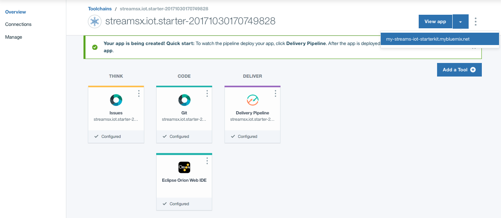

# streamsx.iot.starterkit
This starter kit simplifies the setup for connecting Apache Edgent devices with IBM Streams applications running in the cloud.

The recommended way to connect IoT devices running Apache Edgent is to send the data to the Watson IoT Platform and then retrieve that data from a Streams application running locally or in the IBM Cloud, as illustrated below.


Deploying this starter kit to the IBM Cloud will set up the Streaming Analytics and Watson IoT Platform services for you.  If you choose not to deploy the services automatically, or if you are using an on-prem Streams installation, you can follow these instructions to [setup Streams and the Watson IoT Platform manually](https://developer.ibm.com/streamsdev/docs/setup-instructions-connecting-edgent-streams-applications-watson-iot-platform).


## Deploy and configure the services

### Automatic Deployment

You can use this option if you do not have the services created in IBM Cloud.
Click the the **Deploy to Bluemix** button below to deploy and configure the Streaming Analytics and Watson IoT Platform services.

[](https://bluemix.net/deploy?repository=https://github.com/natashadsilva/streamsx.iot.starter.git)

*Note:* If you have both services created and would like to use automatic configuration,  you need to rename the services to match the names expected by the configuration script before starting the process:
   - Rename the Streaming Analytics service to `Streaming-Analytics`
   - Rename the Watson IoT Platform to `Internet-of-Things-Platform`. These names must match exactly as indicated here.
   Then click the **Deploy to Bluemix** button above.

### Manual Deployment

In IBM Cloud:
  1. Create a Streaming Analytics Service with the name `Streaming-Analytics`
  1. Create a Watson IoT Platform Service with the name `Internet-of-Things-Platform`

Then:
* ```cd nodejs```
* ```npm install```
* ```npm run build```
* ```cd ..```
* ```cf push -n <host prefix>```

## Deploy locally
* ```cd nodejs```
* modify [app/server/config/application-local.js](nodejs/app/server/config/application-local.js), and fill in the credentials for the services where indicated.
* ```npm install```
* ```npm start```


## View the starter kit home page

The starter kit home page is the main access point for your credentials and the best place to get started after deploying the services.


From the toolchain's home page, click **View App** once the deployment is done to go to the home page of your starter kit:

If the **View App** button does not display a link, click **Delivery Pipeline** to check on the status of deployment.

Clicking **View App** will take you to the home page of your starter kit:


# Using the starter kit

Visit the home page to try out the sample application and get your credentials.


##  Using the starter kit to run a complete Edgent-Streams scenario:

1. Run the IoT sensors sample from Edgent:  
   - Download your `device.cfg` file from the "View all Credentials" page of the starter kit.
   - Download Edgent, choose a binary release
   - Unpack Edgent
   - Edgent 1.1.0+: Edit `runiotpsensors.sh` to uncomment out the line starting with `USE_OLD_EVENT_FORMAT`, 
   - Run the IoT sensors application:
    ```
    cd <edgent>/java8/scripts/connectors/iotp
     ./runiotpsensors.sh device.cfg
     ```

2. Submit the `IotPlatformBluemix` application to your Streams instance. Click "Tools" on the starter kit home page and click *Submit IoTPlatform Job* if it is not running.

3. Run a sample Streams appplication in [Python, SPL, or Java](https://github.com/IBMStreams/samples/tree/master/IoT/ReadEdgentEvents/).
   - For Python and Java, download credentials for your Streaming analtyics service by clicking "Streams Credentials" > "Download credentials as JSON".


 
##  Using the starter kit to create your own application

You need the following requirements to create your own application:

- Registered device with the Watson IoT platform and its credentials in a `device.cfg` file.
- The `IoTPlatform` application running in your instance
- Credentials for your Streaming analtyics service. 


### How to download credentials for use with Edgent and Streams
Perform the following tasks to meet the aforementioned requirements. From the home page, click **View all credentials**:

- Under "Edgent credentials", download your device credentials by clicking "Download device.cfg"
- In the same page, download credentials for your Streaming analtyics service by clicking "Streams Credentials" > "Download credentials as JSON".
- Before running your Streams application, submit the `IoTPlatform` application: Click “Tools” and “Submit job” if it is not running in your instance. **Note**: When submitted from this page, the application only runs for 1 hour in  order not to incur charges on your Bluemix account.  To run it indefinitely you must submit it directly to the Streaming analytics service. You will need API keys for the Watson IoT Platform. Download the API keys from the starter kit home page: **View All Credentials>Streams Credentials> Download API keys as properties file**.  This page has [manual submission instructions](https://developer.ibm.com/streamsdev/docs/setup-instructions-connecting-edgent-streams-applications-watson-iot-platform#submit)


## Tutorials
1. **Create an Edgent application**. Follow this recipe to [create an Edgent application that sends data to the Watson IoT platform](https://developer.ibm.com/recipes/tutorials/send-events-to-the-watson-iot-platform-from-a-raspberry-pi-running-apache-edgent/).

2. **Create a Streams application**. Complete the follow up to the Edgent recipe to [create a Streams application that processes the data from Edgent](https://developer.ibm.com/recipes/tutorials/connect-apache-edgent-to-the-streaming-analytics-service-using-the-watson-iot-platform/)

## More Resources

- [Cheatsheet for connecting Edgent and Streams applications](https://developer.ibm.com/streamsdev/docs/cheat-sheet-connecting-edgent-streams-applications/)
- [Sample Streams applications on Github](https://github.com/IBMStreams/samples/tree/master/IoT/ReadEdgentEvents)
