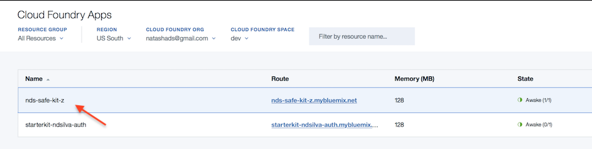

# Standard Plan branch of the streamsx.iot.starterkit 

*This branch will deploy the Standard version of the Streaming Analytics service*.

This starter kit simplifies the setup for using the streamsx.iot toolkit to connect Apache Edgent applications with Streams applications.

The recommended way to analyze data from IoT devices running Apache Edgent is to send the data to the Watson IoT Platform.  Then, you can retrieve that data from a Streams application running locally or in the Streaming Analytics service in the IBM Cloud, as illustrated below.


Deploying this starter kit to the IBM Cloud will set up the Watson IoT Platform and Streaming Analytics services for you. It will also create the credentials you need to connect your Streams and Edgent applications.

If you choose not to deploy the services automatically, or if you are using an on-prem Streams installation, you can follow these instructions to [setup Streams and the Watson IoT Platform manually](https://developer.ibm.com/streamsdev/docs/setup-instructions-connecting-edgent-streams-applications-watson-iot-platform).

## Deploy the starter kit

Click the the **Deploy to IBM Cloud** button below to start deployment. This will take about 10-15 minutes.

[](https://bluemix.net/deploy?repository=https%3A%2F%2Fgithub.com%2FIBMStreams%2Fstreamsx.iot.starterkit.git)

*Note:* If you have both services created and would like to use automatic configuration,  you need to rename the services to match the names expected by the configuration script before starting the process:
   - Rename the Streaming Analytics service to `Streaming-Analytics`
   - Rename the Watson IoT Platform to `Internet-of-Things-Platform`. These names must match exactly as indicated here.
   Then click the **Deploy to IBM Cloud** button above.


# Using the starter kit

After deployment is complete, the best place to get started is the starter kit home page.  

## View the starter kit home page
To access the home page, you must first create a username and password.
### Set a Password
- Open the left hand menu in IBM Cloud, click "Cloud Foundry Apps"

- In the list of apps, click the app, *not* the route.

1. Click **Runtime**
2. Click **Environment variables**
3. Under **User defined**, create a username and password for your starter kit by adding 2 variables called `KIT_OWNER` (username) and `KIT_PASSWORD` (password). Names must be exactly as shown here.  Click **Save**.
4. Click **Visit app URL** to go to the starter kit home page and log in with the username and password you just created.

These steps are illustrated below.


### Open the home page

Clicking **Visit App URL** will take you to the home page of your starter kit where you can log in using the `KIT_OWNER` and `KIT_PASSWORD` as username and password. After a successful log in, the page appears as follows:


From the starter kit home page, you can try out the sample application and get your credentials.


##  Using the starter kit to run a complete Edgent-Streams scenario:

1. Run the IoT sensors sample from Edgent:  
   - Download your `device.cfg` file from the "View all Credentials" page of the starter kit.
   - [Download and unpack Edgent](https://edgent.apache.org), choose a binary release
   - Edgent 1.1.0+: Edit `runiotpsensors.sh` to uncomment out the line starting with `USE_OLD_EVENT_FORMAT`,
   - Run the IoT sensors application:
    ```
    cd <edgent>/java8/scripts/connectors/iotp
     ./runiotpsensors.sh device.cfg
     ```

2. Submit the `IotPlatform` application to your Streams instance. Click "Tools" on the starter kit home page and click *Submit IoTPlatform Job* if it is not running.

3. Run a sample Streams appplication in [Python](https://streams-github-samples.mybluemix.net/?get=IoT%2FReadEdgentEvents%2Fpython%2FStreamsPythonAndEdgent%2F), [Java](https://streams-github-samples.mybluemix.net/?get=IoT%2FReadEdgentEvents%2Fjava%2FStreamingAnalyticsAndEdgent), or [SPL](https://github.com/IBMStreams/samples/tree/master/IoT/ReadEdgentEvents/spl).
   - For Python and Java, download credentials for your Streaming analtyics service by clicking "Streams Credentials" > "Download credentials as JSON".


##  Using the starter kit to create your own application

You need the following requirements to create your own application:

- *Edgent*: For your Edgent application to connect to the Watson IoT Platform, you need a registered "device" with the platform. The "device" does not have to represent a physical device, but simply identifies your Edgent application when it tries to connect to the Watson IoT Platform. The device's credentials are used when creating your Edgent `Topology`.  Download the device credentials from the starter kit home page:
    - Click **View all credentials**, then under **Edgent credentials**, download your device credentials by clicking "Download device.cfg"
- *Java and Python Streams applications only*: credentials for your Streaming analtyics service. These are used to submit applications to the service for execution.   
    - Click **View all credentials** > **Streams Credentials** > **Download credentials as JSON**.
- Lastly, you need the `IoTPlatform` application running in your Streams instance.  


### The IoTPlatform application
This application connects to the Watson IoT Platform to retrieve events from your Edgent application. Then, it publishes the device events as Streams tuples for consumption by other Streams applications.  The following diagram illustrates:


If your Streams application wishes to send a command to the Edgent application, the commands are also sent through the `IoTPlatform` application.  Thus, this application must be running on your instance alongside your Streams application(s).

Click **Tools** on the starter kit home page and if the application is not running, click *Submit IoTPlatform Job*.

**Note**: When submitted from the starter kit home page, the application only runs for 1 hour in  order not to incur charges on your IBM Cloud account.  To run it indefinitely you must submit it directly to the Streaming analytics service. You will need API keys for the Watson IoT Platform. Download the API keys from the starter kit home page: **View All Credentials > Streams Credentials > Download API keys as properties file**.  This page has [manual submission instructions](https://developer.ibm.com/streamsdev/docs/setup-instructions-connecting-edgent-streams-applications-watson-iot-platform#submit).


## Tutorials

1. **Create an Edgent application**. Follow this recipe to [create an Edgent application that sends data to the Watson IoT platform](https://developer.ibm.com/recipes/tutorials/send-events-to-the-watson-iot-platform-from-a-raspberry-pi-running-apache-edgent/).

2. **Create a Streams application**. Complete the follow up to the Edgent recipe to [create a Streams application that processes the data from Edgent](https://developer.ibm.com/recipes/tutorials/connect-apache-edgent-to-the-streaming-analytics-service-using-the-watson-iot-platform/).

## More Resources

- [Cheatsheet for connecting Edgent and Streams applications](https://developer.ibm.com/streamsdev/docs/cheat-sheet-connecting-edgent-streams-applications/)
- [Sample Streams applications on Github](https://github.com/IBMStreams/samples/tree/master/IoT/ReadEdgentEvents).


## Development information: Run the starter kit app locally
If you would like to modify the node js app locally, you need to have the services created on the IBM Cloud.
Then, after cloning the repository:
* ```cd nodejs```
* modify [app/server/config/application-local.js](nodejs/app/server/config/application-local.js), and fill in the credentials for the services where indicated.
* ```npm install```
* ```npm start```
